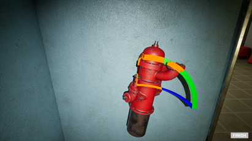
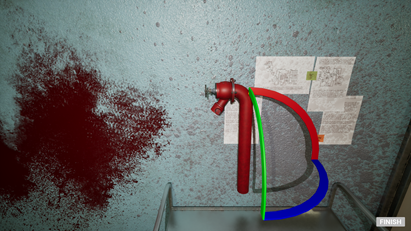
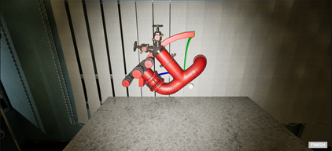
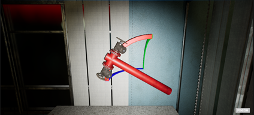

# DeepDive – Level 3 (Individual Level Documentation)
*This document describes the individual Level 3 of DeepDive, including download links, puzzle instructions, and room-by-room mechanics.*  

---

## 🔗 Download Links

### 📥 **Individual Level Download (Google Drive)**  
https://drive.google.com/file/d/1qK1VefqbikIZyLM3-zsKbrTsjRErvpDr/view?usp=sharing

### 📦 **Packaged Build Location**  
DeepDive_Level3_Individual.zip
└── DeepDive_Level3
└── Windows

### 🛠 **Source File Location**  
DeepDive_Level3_Individual.zip
└── DeepDive_Level3
└── DeepDiveLevel3

### ⚠️ Engine Version Requirement  
The Level 3 source file **must be opened using Unreal Engine 5.4**.

---

# 🧩 Level 3 Puzzle Instructions

Level 3 contains **three puzzle rooms**:

1. **Shadow Matching Room**  
2. **Color Memory Room**  
3. **Trap Floor Path Room**

Below are detailed instructions for each room.

---

# 🧩 First Room – Shadow Matching Puzzle

In the first room, players must **rotate four objects** so that their shadows **match the shapes displayed on the whiteboard**.

### 🔍 Puzzle Design Notes
- Precise rotation and placement are required.  
- Key aspects to observe:
  - Rotation angle  
  - Position alignment  
  - Matching specific silhouette vertices  

### 🔊 Sound Feedback
When a player clicks **“Finish”**, if the rotation is correct, a **clear confirmation sound** will play.

### 🖼 Sample Answers
Below are four reference example answers:

|  |  |
|----------------------------|----------------------------|
|  |  |

### 📌 Tips
- Sometimes only **small adjustments** are needed to solve the puzzle.
- Observe how **object vertices** correspond to the whiteboard pattern.

---

# 🎨 Second Room – Color Sequence Memory Puzzle

Upon entering the second room:

### 📃 Step 1 — Pick Up the Note
A note is placed on the table:

After closing the note, you may look at the display screen to observe the **color change sequences**.

### 🎛 Display Behavior
- The display does **not** loop colors continuously.  
- To view the color sequence again:
  1. Interact with the door lock  
  2. Click **“Finish”**  
  3. Observe the display again  

### 🎨 Fixed Color Sequences
The five color sequences always appear in this fixed order:

1. **Red, Yellow, Blue**  
2. **Blue, Yellow, Red**  
3. **Red, Blue, Yellow, Red**  
4. **Yellow, Blue, Red, Yellow, Blue**  
5. **Blue, Red, Yellow, Blue, Yellow, Red**

These sequences correspond to **each step** of the door password.

### ⚡ Speedrun Tip
If you want to solve the room quickly, memorizing the above sequences will allow rapid entry of the password.

---

# 🚨 Third Room – Trap Floor Path Puzzle

The third room contains a **12 × 12 tile floor**.  
Players must walk along the **correct path**, revealed briefly by a spotlight.

### 🔦 How it works:
1. The correct path lights up for **1 second**.  
2. After that, the player may walk on the tiles.  
3. If the player steps on **any incorrect tile**, they must **restart the puzzle**.

### 🎲 Path Randomization
- The correct path is **randomly generated each attempt**.  
- Therefore, **no fixed answer** exists.

### 📸 Recommended Strategy
Players may take a **photo with their phone** during the 1-second reveal to memorize the correct route.

### 🚪 Room Exit
After successfully walking the correct path:
- The door to **Level 4** will open automatically.
- **Note:** The individual build in this document **does NOT contain Level 4**.
- In the **group build**, players access Level 4 through the elevator in this room.

---

