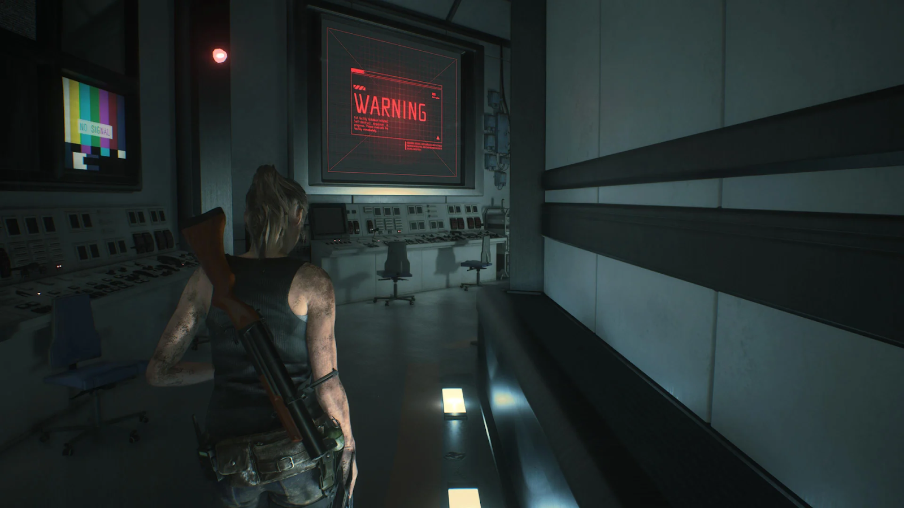
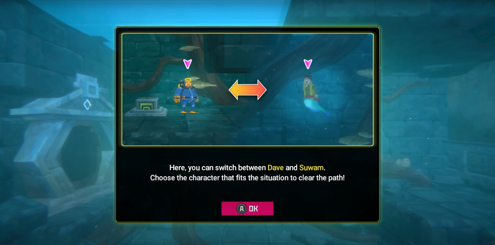
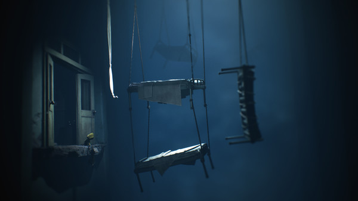
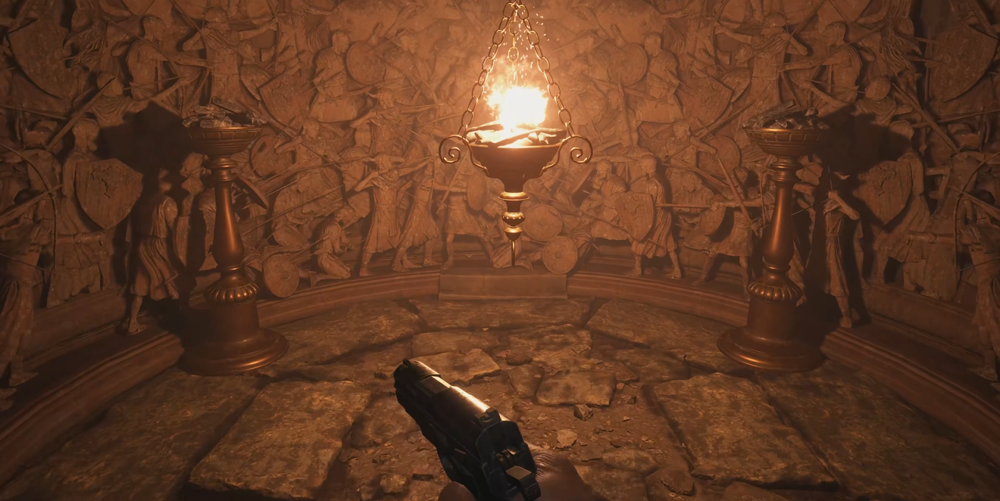
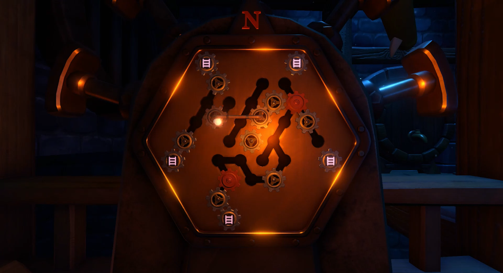
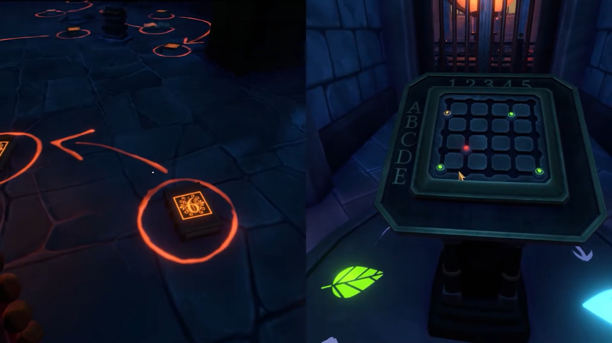
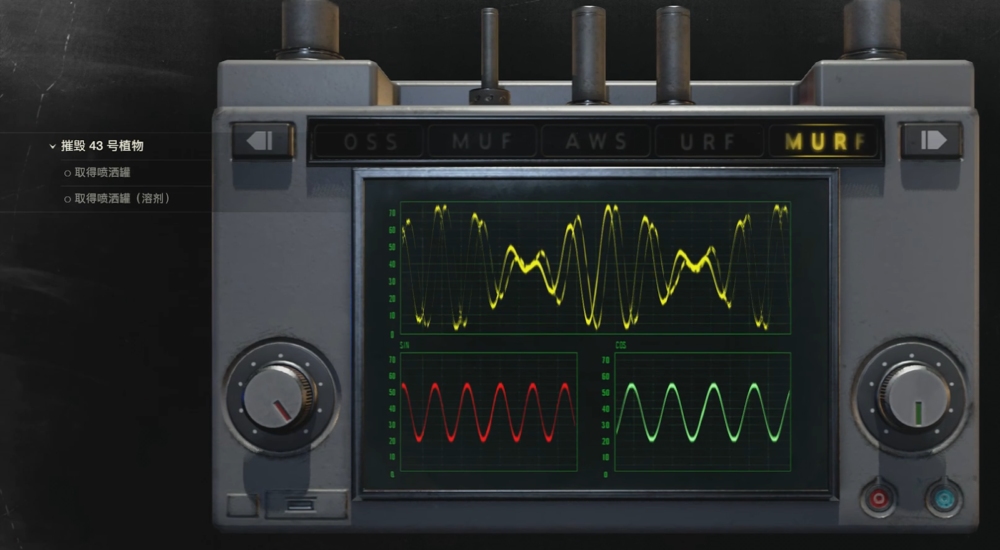
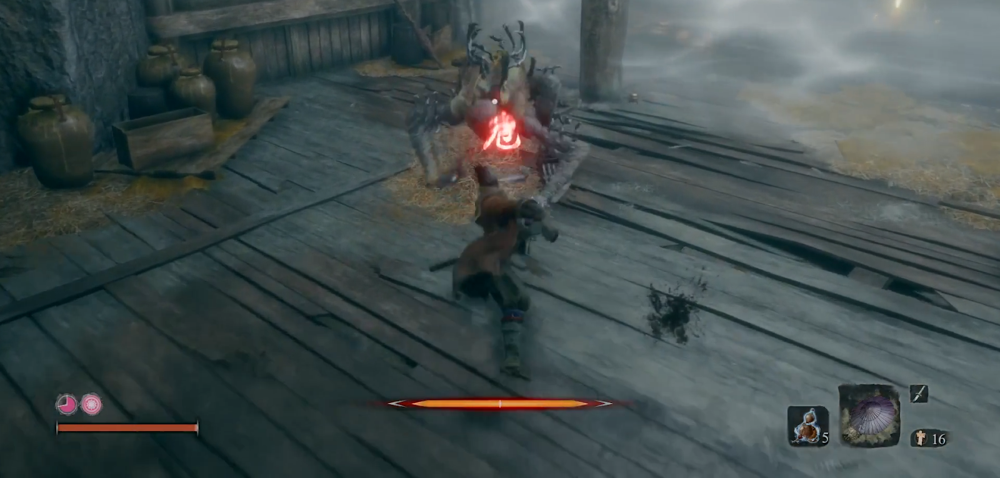
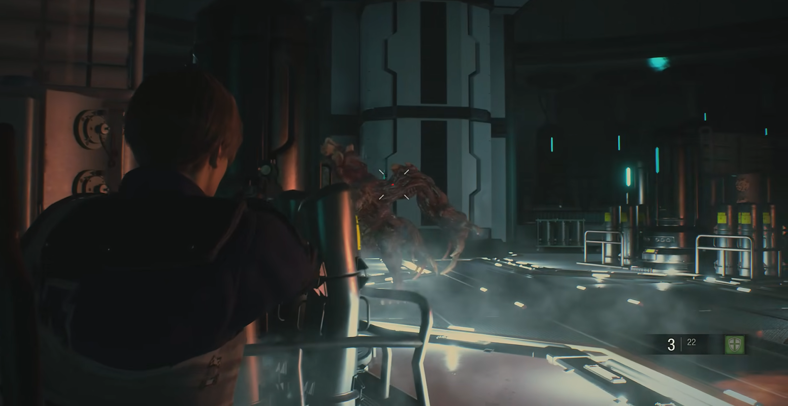
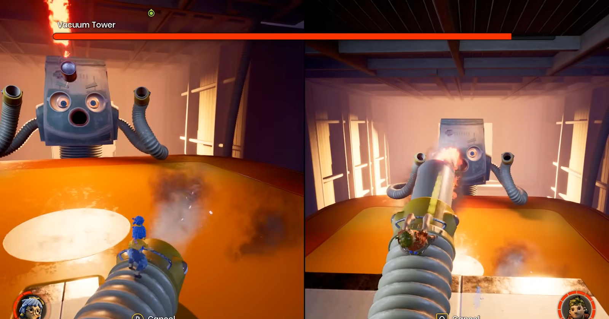

# Deep Dive: Experiment M  
COMP3421 / COMP9415 Computer Graphics 2024 T3  
**Project Proposal**  
**Group Name – Divers**

Team Members:  
- Anthony Lu – z5371988  
- Ken Yu – z5257314  
- Laya (Kairav) Dontamsetti – z5449842  
- Molei Zhou – z5450750  
- Tianxing (Tim) Xu – z5468823  

---

## Contents
- Introduction  
- Comparison with Existing Systems  
- Immersive Atmosphere Creation  
- Puzzle Design  
- Combat Mechanics Overview  
- Purpose of the System  
- Features of the System  
- Technical Depth and Novelty  
- System Flow  
- Level Flow  
- Wireframe / Mock-up  
- Game UI Design  
- Level Map Design  
- References  

---

# Introduction

We decided to create an **escape room** game for our project. According to Wikipedia (Escape Room, 2024):

> *“An escape room … is a game in which a team of players discover clues, solve puzzles, and accomplish tasks in one or more rooms to accomplish a specific goal in a limited amount of time.”*

The game takes place in a **biological research institute** after a severe experimental accident.  
Players explore abandoned floors, uncover hidden stories, solve puzzles, collect items, and eventually fight a final boss in the fifth level.  
The theme combines **horror** and **mystery**, emphasizing atmosphere, puzzles, narrative, and tension.

---

# Comparison with Existing Systems

We compare our game with similar titles including:  
*We Were Here series, Resident Evil series, It Takes Two, The Dark Pictures series, Dave the Diver, Sekiro, Little Nightmares.*

### Immersive Atmosphere Creation

  
*Fig. 1 Resident Evil 7 atmosphere and Dark Pictures environmental design*

Immersion can be achieved through:
- Novel gameplay  
- Strong narrative  
- Balance between story + gameplay  
- Lighting, environment, sound, pacing  

We analyzed first-person vs third-person perspectives.  
Although most escape room games use first-person for immersion, we adopt **third-person** for:

- Reduced puzzle difficulty  
- Better spatial awareness  
- More cinematic character portrayal  
- Better combination with narrative  

However, to **compensate for immersion loss**, we introduce:
- **Body-switch mechanic** (Level 4)  
- **2.5D segments** (Level 3)  

  
*Fig. 2 First-person vs third-person puzzle perspectives*

  
*Fig. 3 Body-switch examples from Resident Evil 2 & Dave the Diver*

  
*Fig. 4 Little Nightmares II – Example of 2.5D immersive puzzle design*

---

# Puzzle Design

Puzzles span nearly all game genres and act as “cream on a cake”—they enrich gameplay, balance pacing, and increase player engagement.

Types referenced:
- Find-difference  
- Object search  
- Light reflection  
- Sudoku  
- Chess-like logic  
- Jigsaw  
- Prop combination  
- Many more  

  
*Fig. 5 Puzzle examples from Resident Evil Village and We Were Here Together*

We identified key puzzle design challenges:
- Too many puzzles → fatigue  
- Puzzles too hard → frustration  
- Puzzles too easy → boredom  
- Experienced players vs novice players balance  

Thus, puzzles in our game stay:
- Simple  
- Thematic  
- Narrative-supporting  
- Non-frustrating  

  
*Fig. 6 Complex vs simple puzzle design comparison*

---

# Combat Mechanics Overview

Escape-room combat styles:
1. **Direct combat** – shooting / melee  
2. **Indirect combat** – puzzle-based enemy defeat  

  
*Fig. 7 Combat systems from It Takes Two, Resident Evil, Sekiro*

We balance action elements while preserving puzzle identity.

---

# Purpose of the System

## Overall Purpose
The game aims to deliver:
- A sense of wonder  
- Immersive puzzle environments  
- Narrative-driven discovery  
- Varied, engaging challenges  

Target audience: **young adults and above**.

## Problems with Games in Similar Genre
We address common issues:

### 1. Repetitive puzzles  
→ Five distinct levels with unique mechanics.

### 2. Lack of thematic coherence  
→ Hidden story elements & chemical link across levels.

### 3. Lack of engagement  
→ Dynamic difficulty, varied mechanics.

### 4. Puzzle difficulty  
→ Embedded hint system through research notes.

---

# Modules in our System

## Level 1 – Lasers & Mirrors (Ken)

Inspired by *Pokémon Diamond/Pearl* ice puzzles and *Portal* laser redirection.

  
*Fig. 8 Pokémon sliding puzzle & Portal laser puzzle*

Players:
- Place mirrors  
- Redirect lasers  
- Break obstacles with pickaxe  
- Unlock chests  
- Find hidden intel  

---

## Level 2 – Code Deciphering (Kairav)

Inspired slightly by *Escape from Mystwood Mansion*, but using:
- Custom symbolic language  
- Notes, documents  
- Blacklight-revealed clues  
- Chemistry puzzle with recipes  

  
*Fig. 9 Example puzzle types*

Two rooms:
1. Office (whiteboard, sticky notes, blacklight)  
2. Chemistry lab (pipes puzzle, cleaning, mixing)  

---

## Level 3 – Shadows & Colours (Molei)

Inspired by *Iris.Fall* and *Zenless Zone Zero*.

  
*Fig. 10 Shadow puzzles*

Three sections:
1. Create shadow patterns using props  
2. Colour sequence memory  
3. Spotlight path memory with trap tiles  

Environmental storytelling:
- Broken furniture  
- Bloodstains  
- Claw marks  
- Dim lighting  

---

## Level 4 – Body-switch Maze (Tim)

Inspired by:
- Zelda dungeon design (Hakoniwa style)  
- Dave the Diver’s character-switch missions  

  

  

  

2D maze with 3D modelling, fixed perspective.  
Includes:
- Box pushing  
- Laser alarms  
- Dark rooms  
- Drone lighting  
- Electric floors  
- Multi-route exploration  

---

## Level 5 – Enemy Level (Anthony)

Inspired by *Dungeons of Dreadrock*.

Mechanics:
- Binary search scanning (3 attempts)  
- Unfreeze chemicals  
- Build a laser trap  
- Lure enemy  
- Freeze ray + shotgun  
- Escape timer  

---

# Features of the System

## Narrative

Premise:
- Player investigates abandoned underground research institute  
- Researchers enhanced human abilities → mutations  
- Survivors sealed monsters in deepest floor  
- Player collects documents to uncover story  
- Lure components scattered across floors  

---

## Interaction Between Narrative & Gameplay

Collectable intel reveals:
- Researcher desperation  
- System failures  
- Janitor personal diary (linked surname to contractor)  
- Timer due to scheduled demolition  

---

## Game Mechanics

Includes:
- Physics simulations  
- Collision detection  
- Gravity interactions  
- Object grabbing & inspection  
- Stationary lighting + interactive light sources  
- Reset of level abilities  

---

## Puzzle Designs (Summaries Repeated from Modules)

Level 1:  
- Mirrors + lasers  
- Break rubble  
- Hidden intel under desks  

Level 2:  
- Symbol deciphering  
- Pipes  
- Chemistry mixing  
- Hidden blacklight notes  

Level 3:  
- Shadow matching  
- Colour memory  
- Trap tiles  

Level 4:  
- Body-switch  
- Navigation  
- Box and light puzzles  

Level 5:  
- Binary search  
- Chemical thaw  
- Trap assembly  

---

## Summary of Interaction Mechanisms

(Full table reproduced)

---

# Visual Elements

## Environmental Design

Inspired by:
- Resident Evil  
- We Were Here  

Atmosphere via moody lighting:
- Cool → green tones  

  

---

## Potential Environment Assets

Includes:
- Bunsen burner  
- Laser device  
- Test tubes  
- Fire extinguisher  
- Pipes, boxes, appliances  
- Doors, clutter  

(Placeholders for images)  

---

## Character Design

Player characters:  
  

Drone:  

---

## Creature Design

Creatures:  

---

# Technical Depth and Novelty

## Novelty

Our system uniquely combines:
- Escape room puzzles  
- 3D immersive graphics  
- Body-switch mechanics  
- Light combat  
- Boss battle  
- Multi-level narrative cohesion  

Comparison with:
- Dave the Diver (2D limitations)  
- Dreadrock (top-down maze limitations)  

  

---

## Shortcomings

Challenges:
- Puzzle difficulty balancing  
- Ensuring engagement  
- Avoiding repetition  

Solutions:
- Distinct module mechanics  
- Subtle clue system  
- Mixed action + puzzles  

---

## Technical Depth

Comparison with *The Lab – Escape Room*:  
- We use third-person  
- More environmental storytelling  
- Multi-level structure  

---

# System Flow

Levels progress linearly.  
Death → level restart or checkpoint.

---

# Level Flow

(Contains Figures 24–28)  
Examples:

  
  
  
  

---

# Wireframe / Mock-up of System

  
  
  
  
  

---

# Level Map Design

  
  
  
  

---

# References

(Full reference list preserved exactly from PDF.)

